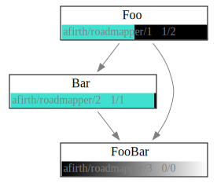

# Roadmapper

Makes graphviz maps of github milestones

# How to make roadmaps

Use github milestones as "epics" i.e. a final state to be achieved.
Associate issues with the milestone (must be in the same repo) if you want.

Declare dependencies between milestones by adding the dep to the milestone description

`/depends org/repo/<number>` - note that milestone # != issue #

Run this script to get a `dot` and `svg`

# How to keep roadmaps updated

1. Fork this repo
1. Update the config.yaml
1. Let github actions update the repo for you
  1. You'll need to provide a github PAT with repo scope if you want to read private repositories
  1. Optionally change when it runs (issue open/close, cron...)
1. Add the image as a relative link to the README, or whatever other docs you want

# Roadmaps
## Roadmapper
> This repo

## Stoneboard
> Has a different structure for noting dependencies, therefore no lines

# Prior Art

Heavily inspired by https://github.com/plan3/stoneboard
